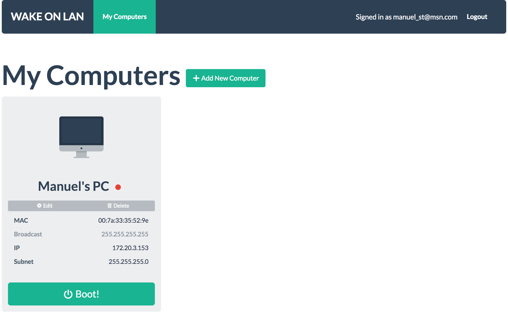

# PHP Wake on LAN (WOL) App



## Installation
```bash
touch storage/database.sqlite
php artisan migrate
```

## Usage

### Create a User
```bash
php artisan user:create <email>
```

## License

This Tool is open-sourced software licensed under the [MIT license](http://opensource.org/licenses/MIT)
